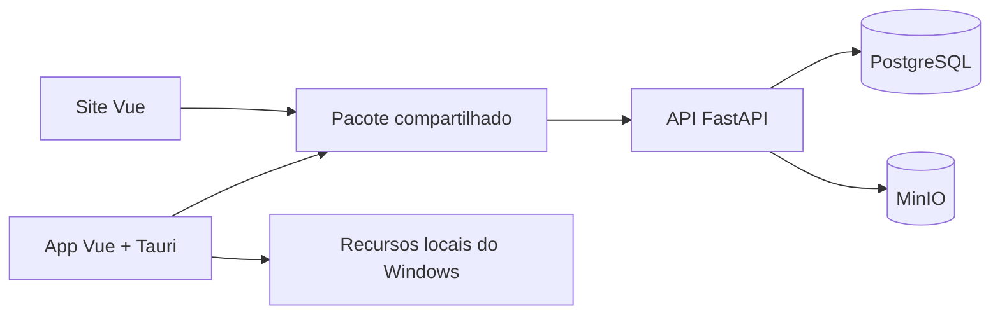

# Arquitetura das aplicações

O Catálogo de Bordados possui três aplicações independentes que compartilham o
mesmo domínio. O backend concentra regras de negócio e persistência; site e
desktop coletam dados e apresentam os resultados da API.



## Componentes

### Backend

O diretório `backend/` é responsável por:

- validar e processar matrizes `.PES`;
- gerar previews e persistir metadados;
- controlar catálogo, categorias, favoritos, lixeira e vitrines;
- armazenar arquivos no MinIO e registros no PostgreSQL;
- entregar previews, links públicos e downloads.

O backend não conhece APIs do navegador ou do Tauri.

### Site web

O diretório `frontend/` contém a aplicação Vue publicada pelo Nginx. Ela oferece
os fluxos administrativos compatíveis com o navegador e a página pública das
vitrines. Não possui acesso nativo ao sistema de arquivos ou às unidades do
Windows.

### Aplicativo desktop

O diretório `app/` contém uma interface Vue empacotada pelo Tauri. A camada Rust
expõe somente operações nativas necessárias para selecionar uma pasta autorizada,
ler seus arquivos `.PES` e escrever em uma unidade removível escolhida.

O Tauri não acessa PostgreSQL ou MinIO diretamente: toda regra de catálogo passa
pela API.

### Código compartilhado

`packages/shared/` contém contratos TypeScript, serviços HTTP, componentes,
views e utilitários independentes da plataforma. Cada interface fornece seus
adaptadores em:

```text
frontend/src/platform/  implementações do navegador
app/src/platform/       implementações do Tauri/Windows
```

O pacote compartilhado não deve importar `@tauri-apps/*`, módulos Rust,
configurações de Docker/Nginx ou variáveis de ambiente diretamente.

## Matriz de funcionalidades

| História | Web | Desktop | Observação |
|---|---:|---:|---|
| US01 — Pesquisar desenhos | Sim | Sim | Fluxo compartilhado. |
| US02 — Visualizar detalhes | Sim | Sim | Fluxo compartilhado. |
| US03 — Importar em lote | Limitado | Completo | O desktop lê pastas recursivamente. |
| US04 — Editar desenho | Sim | Sim | Metadados pela API. |
| US05 — Remover desenho | Sim | Sim | Lixeira compartilhada. |
| US06 — Gerenciar categorias | Sim | Sim | Fluxo compartilhado. |
| US07 — Gerenciar favoritos | Sim | Sim | Fluxo compartilhado. |
| US08 — Baixar matriz | Sim | Sim | Download do backup original. |
| US12 — Criar vitrine | Sim | Sim | Administração compartilhada. |
| US13 — Visualizar vitrine | Sim | Não | Página pública no navegador. |
| US14 — Gerenciar vitrines | Sim | Sim | Administração compartilhada. |
| US15 — Enviar para máquina | Não | Sim | Somente unidade removível Windows. |
| US16 — Carregamento progressivo | Sim | Sim | Paginação, lazy loading e cache. |

## Dependências permitidas

```text
frontend ─┐
          ├──> packages/shared ──> backend HTTP API
app ──────┘

app ──> Tauri/Rust ──> recursos locais autorizados
```

Não são permitidos:

- importações entre `frontend` e `app`;
- dependências Tauri em `frontend` ou `packages/shared`;
- acesso direto do Tauri ao banco ou ao storage;
- duplicação de regras de negócio do backend nas interfaces.

## Desempenho do catálogo

`GET /api/v1/catalogo/desenhos` aplica paginação, filtros e ordenação no backend.
As interfaces compartilham cache de consultas, evitam requisições duplicadas e
carregam previews quando os cards se aproximam da área visível. Previews ativos
respondem com `ETag` e `Cache-Control`.

Previews da lixeira e das vitrines públicas têm política mais conservadora para
refletir alterações de disponibilidade rapidamente.

## Regra para novas funcionalidades

Antes de implementar uma história, determine:

1. se depende de um recurso local do Windows;
2. se precisa ser acessada publicamente pelo navegador;
3. se representa regra de negócio ou apenas apresentação.

Recursos Windows ficam em `app/src/platform` ou `app/src-tauri`; páginas públicas
ficam em `frontend`; regras de negócio ficam no backend.

## Documentação relacionada

- [Funcionalidades](features.md)
- [Aplicativo desktop](desktop.md)
- [API](api.md)
- [Segurança](security.md)
