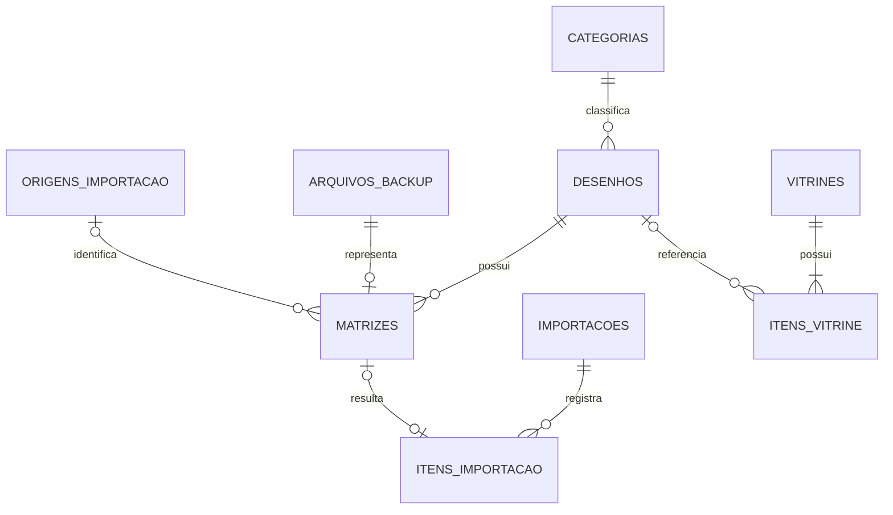

# Banco de dados e armazenamento

O backend usa PostgreSQL para metadados, Alembic para versionamento do schema e
MinIO/S3 para os arquivos binários. O banco não armazena o conteúdo do `.PES` nem
do PNG; ele guarda as chaves dos objetos.

## Entidades

| Entidade | Responsabilidade |
|---|---|
| `categorias` | Classificação principal opcional do desenho. |
| `desenhos` | Nome, descrição, favorito, preview e estado da lixeira. |
| `arquivos_backup` | Nome original, hash, tamanho, MIME e chave do `.PES`. |
| `origens_importacao` | Identificação informativa da origem do arquivo. |
| `matrizes` | Variação, dimensões, pontos, cores e vínculos do arquivo. |
| `importacoes` | Totais e status de uma execução de importação. |
| `itens_importacao` | Resultado individual de cada arquivo processado. |
| `vitrines` | Token, título, cliente, validade e estado público. |
| `itens_vitrine` | Snapshot de nome e preview de cada opção compartilhada. |

## Relacionamentos



Regras relevantes do schema atual:

- categoria e origem são opcionais para o desenho/matriz;
- uma matriz referencia exatamente um arquivo de backup;
- `hash_sha256` de `arquivos_backup` é único;
- excluir um desenho remove suas matrizes, mas itens de vitrine preservam os
  snapshots e mantêm `desenho_id` opcional;
- categorias vinculadas não podem ser excluídas pela API sem reclassificação;
- índices apoiam pesquisa, favoritos, categoria, lixeira, paginação e tokens.

## Objetos no MinIO

O storage usa chaves internas aleatórias:

```text
matrizes/{uuid}.pes
previews/{uuid}.png
```

O nome original existe apenas nos metadados e é usado no download. A exclusão
permanente remove o preview e os backups relacionados; mover para a lixeira não
remove objetos imediatamente.

Vitrines preservam snapshots de preview. A exclusão de uma vitrine remove somente
a seleção compartilhada e seus snapshots, sem remover desenhos do catálogo.

## Migrations

O Alembic lê `DATABASE_URL` da configuração do backend. A partir de `backend/`:

```bash
alembic upgrade head
```

As migrations ficam em `backend/alembic/versions/` e devem acompanhar qualquer
alteração de modelo. Antes de produção, faça backup e aplique primeiro em
homologação.

## Backup e restauração

Uma recuperação completa exige os dois conjuntos:

1. dump consistente do PostgreSQL;
2. cópia/versionamento do bucket configurado em `S3_BUCKET`.

Restaurar somente o banco pode deixar chaves sem objetos; restaurar somente o
bucket pode produzir objetos sem registros. O repositório não contém automação de
backup ou restauração, portanto frequência, retenção e teste de recuperação devem
ser definidos na infraestrutura.

## Documentação relacionada

- [API](api.md)
- [Desenvolvimento](development.md)
- [Deploy](deployment.md)
- [Segurança](security.md)
